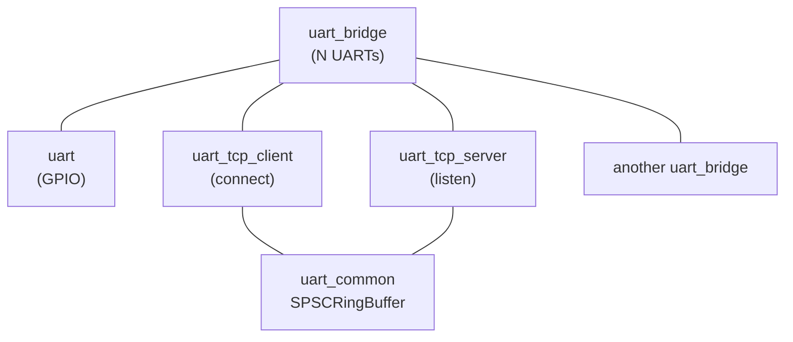
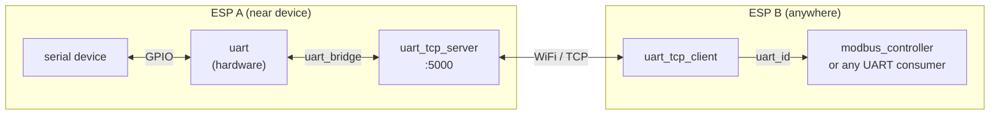
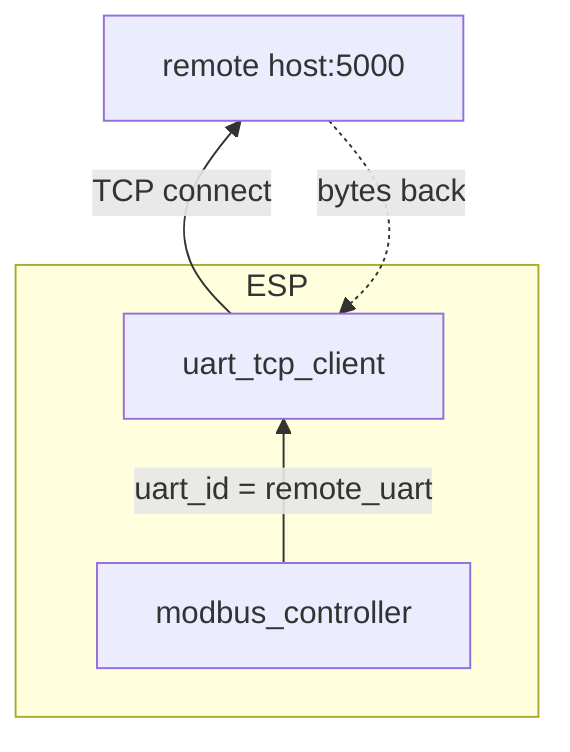
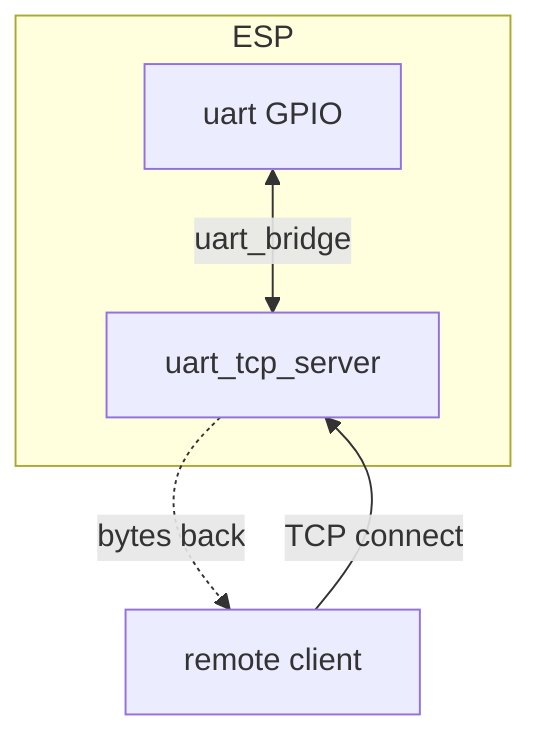
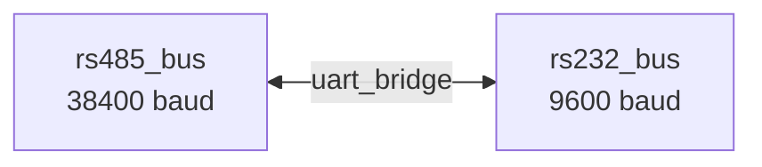
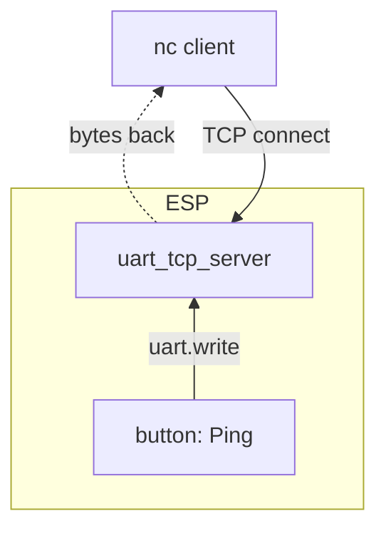
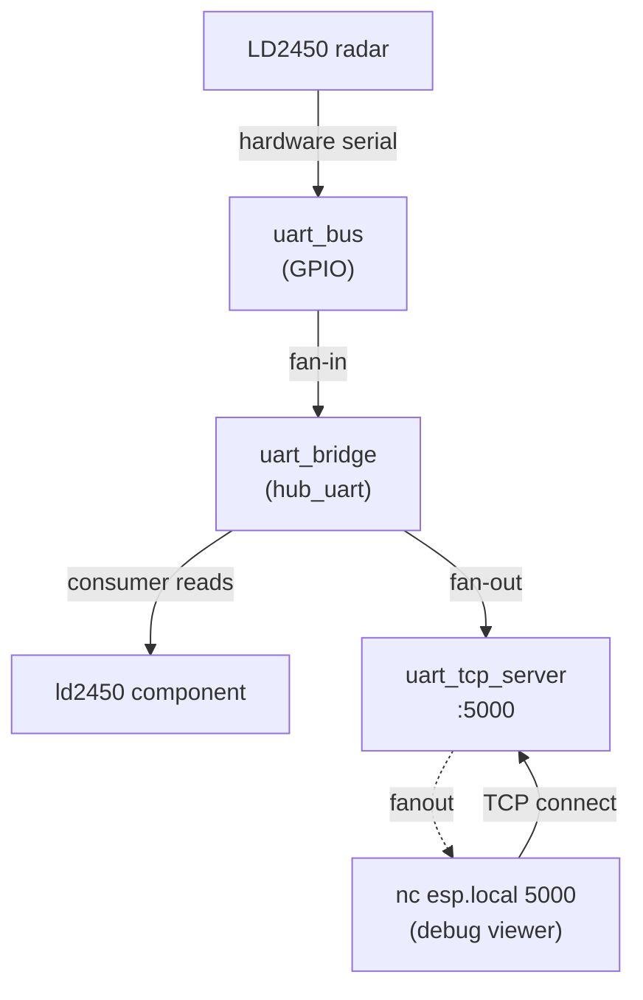

# esphome-uart-link

ESPHome external components for UART interconnection. Bridges hardware serial ports to TCP networks and each other.
Transport-agnostic: any UART consumer sees the standard `available()` / `read_array()` / `write_array()` interface, whether bytes arrive from GPIO pins, a TCP socket, or another UART.

## Components

| Component | Purpose |
|---|---|
| **uart_tcp_client** | Outbound TCP client which *is* a `UARTComponent`<br>use as a drop-in `uart_id` for any UART consumer. |
| **uart_tcp_server** | TCP server which *is* a `UARTComponent`<br>connected clients' data is available through the standard UART interface. |
| **uart_bridge** | N-way byte forwarder between `UARTComponent` instances.<br>Can itself be used as a `uart_id` for multi-tap topologies. |
| **uart_common** | Internal SPSC ring buffer (no user-facing config). |

The three configurable components each support multiple instances using standard ESPHome list syntax (`-` prefix with unique `id`s).



## Installation

Add to your ESPHome YAML:

```yaml
external_components:
  - source:
      type: git
      url: https://github.com/nebulous/esphome-uart-link
```

## Component Reference

### `uart_tcp_client`

Connects to a remote TCP server and **is** a `UARTComponent`, not a wrapper around one. UART consumers use it as a drop-in `uart_id`; reads and writes go over the TCP connection.

```yaml
uart_tcp_client:
  id: remote_serial
  host: 192.168.1.100
  port: 5000
  rx_buffer_size: 4096       # ring buffer size (default 4096)
  reconnect_interval: 5s     # auto-reconnect on disconnect (default 5s)
  stall_timeout: 15s         # force reconnect after silence (default 15s, 0 to disable)
```

Includes stall detection: if no bytes arrive for `stall_timeout`, it forces a reconnect.

### `uart_tcp_server`

Listens on a TCP port and **is** a `UARTComponent` backed by TCP sockets. Reads return bytes written by TCP clients; writes go to connected clients. Each client gets its own ring buffer, and bytes from all clients merge into a single read stream.

```yaml
uart_tcp_server:
  id: tcp_serial
  port: 5000
  max_clients: 2             # simultaneous connections (default 2, max 16)
  rx_buffer_size: 4096       # per-client RX ring buffer (default 4096)
  tx_buffer_size: 16384      # per-client TX queue (default 16384 on ESP32, 0 on ESP8266)
  client_mode: fanout        # fanout (default) or exclusive
  idle_timeout: 0ms          # kick idle clients (0 = disabled)
```

**TX buffering:** writes go to the TCP send buffer first. When it fills, a per-client queue of `tx_buffer_size` bytes holds the overflow until ACKs free space, so `write_array` never blocks. Defaults: 16384 on ESP32, 0 on ESP8266. Set 0 to disable buffering; a short write then drops the remainder. Size it to the largest expected burst minus the send window (about 5.7 KB on ESP32, 2.9 KB on ESP8266).

**Client modes:**
- `fanout`: all connected clients see the same TX stream. Good for multi-monitor/tap scenarios.
- `exclusive`: only one client at a time. New connections disconnect the previous client. Better for command-response protocols.

### `uart_bridge`

N-way byte forwarder between UART references. Works with combinations of hardware UART, TCP client, TCP server, USB CDC ACM, or other bridges. The bridge itself is a `UARTComponent`. Consumers use it as a `uart_id` for multi-tap topologies.

```yaml
uart_bridge:
  uarts: [rs485_bus, tcp_bus]
  buffer_size: 512           # internal copy buffer (default 512)
```

Each UART in the list can have a `flow` setting:

```yaml
uart_bridge:
  id: hub_uart
  uarts:
    - hw_uart                # flow: both (default)
    - uart: debug_tap
      flow: from_bridge      # read-only tap: sees traffic, can't inject
```

**Flow options:**

| flow | Bridge reads from it | Bridge writes to it | Use for |
|---|---|---|---|
| `both` (default) | yes | yes | Bidirectional participant (hardware UART, two-way link) |
| `from_bridge` | no | yes | Read-only tap (debug viewer, passive monitor) |
| `to_bridge` | yes | no | Inject-only source (feeds data in, receives nothing) |

`id` is optional. Only needed when a UART consumer needs to read or write through the bridge itself.

**Supported topologies:**

| UARTs | Use Case |
|---|---|
| hardware UART + hardware UART | RS485 ↔ RS232 protocol converter |
| hardware UART + tcp_server | Serial-to-network bridge |
| tcp_client + hardware UART | Remote serial port consumer |
| tcp_client + tcp_server | Network serial proxy/repeater |
| hardware UART + tcp_server (`from_bridge`) + consumer via bridge `id` | Multi-tap (consumer + debug viewer) |

## Common Examples

### Virtual serial cable over WiFi (two ESPs)

Replace a serial cable with two ESPs talking over WiFi.
ESP A sits next to the serial device and bridges its hardware UART to a TCP port.
ESP B connects to A over WiFi and presents the remote UART to ESPHome components.
A UART consumer on ESP B sees the device as if it were locally connected.



**ESP A**: connected to the serial device, listening on TCP:

```yaml
external_components:
  - source:
      type: git
      url: https://github.com/nebulous/esphome-uart-link

uart:
  id: device_uart
  tx_pin: GPIO17
  rx_pin: GPIO18
  baud_rate: 9600

uart_tcp_server:
  id: tcp_link
  port: 5000
  client_mode: exclusive

uart_bridge:
  uarts: [device_uart, tcp_link]
```

**ESP B**: connects to ESP A, presents the remote UART to any consumer:

```yaml
external_components:
  - source:
      type: git
      url: https://github.com/nebulous/esphome-uart-link

uart_tcp_client:
  id: remote_uart
  host: esp-a.local
  port: 5000

# Use remote_uart like any local UART: modbus, meters, sensors, etc.
modbus_controller:
  uart_id: remote_uart
```

Two ESPs and a WiFi link replace the serial cable, socat, or ser2net.
Each ESP only needs power; the serial device can be anywhere on the network.

**Common applications:**
- RS485 Modbus devices in remote locations (solar inverters, smart meters, BMS)
- Zigbee coordinator serial bridge (ZHA / Zigbee2MQTT over WiFi)
- HVAC serial connections (Mitsubishi, Daikin) where running a cable is impractical
- Serial devices in inconvenient locations

**Caveat:** This is only as reliable as the WiFi link.
For high-throughput or always-on links, consider a wired Ethernet ESP or a physical cable.

### Connect a UART component to a remote host, such as an ethernet serial bridge over TCP



`uart_tcp_client` is a `UARTComponent`; UART consumers reference it via `uart_id`:

```yaml
uart_tcp_client:
  id: remote_uart
  host: 192.168.1.100
  port: 5000

modbus_controller:
  uart_id: remote_uart
```

### Expose a hardware serial port over the network



`uart_tcp_server` is a UARTComponent backed by TCP. Use `uart_bridge` to connect it to a hardware UART:

```yaml
uart:
  id: serial_port
  tx_pin: GPIO4
  rx_pin: GPIO5
  baud_rate: 9600

uart_tcp_server:
  id: network_port
  port: 5000
  client_mode: exclusive

uart_bridge:
  uarts: [serial_port, network_port]
```

Then from any machine on the network: `nc esp-device.local 5000`

### Bridge two hardware UARTs



Protocol conversion between two serial buses running at different speeds:

```yaml
uart:
  - id: rs485_bus
    tx_pin: GPIO17
    rx_pin: GPIO18
    baud_rate: 38400
  - id: rs232_bus
    tx_pin: GPIO4
    rx_pin: GPIO5
    baud_rate: 9600

uart_bridge:
  uarts: [rs485_bus, rs232_bus]
```

### Use a TCP server as a virtual UART (no hardware serial, no bridge)



`uart_tcp_server` can be used directly as a `uart_id`. No hardware UART or `uart_bridge` needed.
The TCP clients *are* the serial device.
Any automation that writes to a UART can write to it.
If no clients are connected, writes are silently dropped.

```yaml
uart_tcp_server:
  id: log_uart
  port: 2323
  max_clients: 4
  client_mode: fanout

button:
  - platform: template
    name: "Ping"
    on_press:
      - uart.write:
          id: log_uart
          data: "Hello from ESP!\r\n"
```

Then from any machine on the network: `nc my-esp.local 2323`
Press the button and the text appears in your nc session.

This pattern scales to any UART consumer component that accepts a `uart_id`.
See [InfinitESP](https://github.com/nebulous/infinitesp) for a production example:
a custom `sam_ascii` component uses `uart_tcp_server` directly as its UART to expose an HVAC CLI over the network.

### Multi-tap: debug viewer alongside a UART consumer

ESPHome's UART API consumes bytes on read, so only one component can read from a given hardware UART.
`uart_bridge` solves this: it reads from the hardware UART, buffers the bytes internally,
and fans them out to additional UARTs. A UART consumer reads from the bridge itself.



```yaml
external_components:
  - source:
      type: git
      url: https://github.com/nebulous/esphome-uart-link

uart:
  id: uart_bus
  tx_pin: GPIO5
  rx_pin: GPIO4
  baud_rate: 256000

uart_tcp_server:
  id: radar_tap
  port: 5000
  client_mode: fanout
  max_clients: 4

uart_tcp_server:
  id: second_tap
  port: 5001
  client_mode: fanout
  max_clients: 2

uart_bridge:
  id: hub_uart
  uarts:
    - uart_bus
    - uart: radar_tap
      flow: from_bridge
    - uart: second_tap
      flow: from_bridge

ld2450:
  id: ld2450_radar
  uart_id: hub_uart
  throttle: 100ms
```

Then `nc esp.local 5000` shows a live raw byte stream
while the ld2450 component works normally.

**How it works:**
The bridge reads from `uart_bus` and fans bytes out to both its internal ring buffer
(for the `ld2450` consumer) and to `radar_tap` (for nc).
The `flow: from_bridge` setting means `radar_tap` only receives. nc can't inject
bytes back into the bridge and through to the radar.

**Without `flow: from_bridge`:**
nc could type bytes that flow through `radar_tap` into the bridge and out `uart_bus` to the radar.
If the ld2450 component is also sending commands, both sides would be talking to the device
simultaneously with no coordination.
Using `from_bridge` prevents this.

### Other topologies

- **Multi-party TCP bridge:**
  ```yaml
  uart_bridge:
    uarts: [tcp_server_a, tcp_server_b]
  ```
  Bridge two TCP servers with no hardware UART. External clients connect to both.

- **Chained bridges:**
  Bridge hardware UART → tcp_client → (network) → tcp_server → bridge → hardware UART.
  Serial over two network hops. Each hop adds latency; a single longer cable avoids the extra hops.

- **Multiple independent bridges:**
  ```yaml
  uart_bridge:
    - uarts: [rs485_bus, tcp_server_1]
    - id: debug_hub
      uarts:
        - rs232_bus
        - uart: tcp_server_2
          flow: from_bridge
  ```
  Each bridge is independent. Multiple bridges use standard ESPHome list syntax.

## Design Notes

### Thread safety

`uart_tcp_client` and `uart_tcp_server` receive data in TCP callbacks that fire from
a TCP thread (ESP32) or the main loop (ESP8266).
The SPSC ring buffer in `uart_common` handles the producer/consumer split:
TCP callback writes, main loop reads. No mutex needed.

`uart_bridge` operates entirely in `loop()`, single-threaded, no concurrency concerns.

### Backpressure

`uart_bridge` has no flow control.
If a destination can't keep up, bytes buffer in its transport layer
(DMA/FIFO for hardware UART; AsyncClient send buffer plus the `tx_buffer_size` queue for `uart_tcp_server`).
The bridge assumes both sides can keep up.
For high baud rates, increase `buffer_size`.

### Raw byte stream: no flow control or RFC 2217

The TCP transport carries raw bytes only.
It does not implement RFC 2217 (telnet COM port control),
hardware flow control signals (RTS/CTS, DTR/DSR),
or baud rate negotiation over the network.
The hardware UART baud rate is set once in YAML and stays fixed.

**Works well:**
protocols that use a fixed baud rate and don't depend on modem control signals
(Modbus RTU, most smart meters, HVAC serial, BMS, RS485 buses, raw data streaming).

**Doesn't work:**
scenarios that require changing baud rates mid-session
(e.g., the 1200-baud reset trick some bootloaders use)
or toggling DTR/RTS from the remote end
(e.g., `esphome upload` for some platforms).
For those, use a USB connection or a full RFC 2217 bridge like ser2net.

### Poll-based limitation

ESPHome's UART API is purely poll-based (`available()` / `read_array()`).
There are no RX callbacks.
The bridge must live in `loop()`, which fires every few ms.
At 115200 baud (~11.5 bytes/ms) and below, loop timing is not the bottleneck
on ESP32 or ESP8266. The UART FIFO and driver-level buffering absorb it.
At higher rates (460800+), the gap between `loop()` invocations can exceed
the hardware FIFO depth; increase `buffer_size` or shorten the loop interval.

### Migration from uart_a / uart_b syntax

The `uart_a` / `uart_b` syntax still works but is deprecated:

```yaml
# Deprecated (still accepted, will produce a warning)
uart_bridge:
  uart_a: rs485_bus
  uart_b: rs232_bus
  direction: bidirectional

# Current syntax (equivalent)
uart_bridge:
  uarts: [rs485_bus, rs232_bus]
```

Multiple bridges use list syntax:
```yaml
uart_bridge:
  - uarts:
      - rs485_bus
      - tcp_server_a
  - uarts: [rs232_bus, tcp_server_b]
```

### License: MIT
