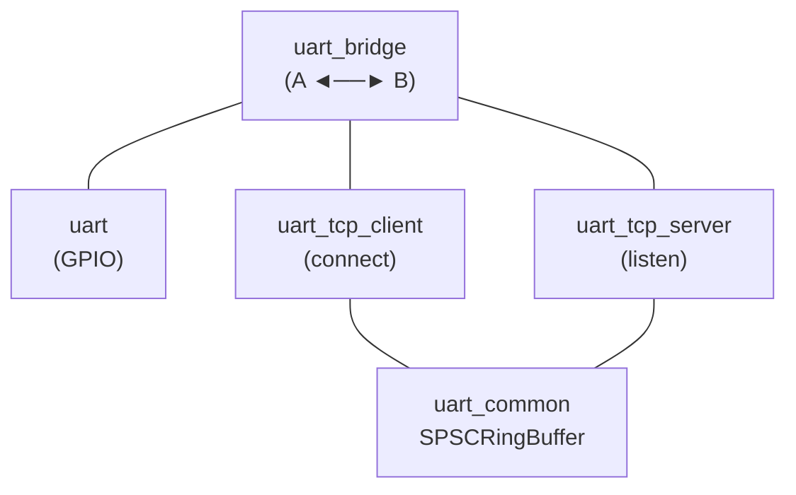

# esphome-uart-link

ESPHome external components for UART transport. Bridge hardware serial ports to TCP networks and each other. Transport-agnostic: any UART consumer sees the standard `available()` / `read_array()` / `write_array()` interface regardless of whether bytes come from GPIO pins, a TCP socket, or another UART.

## Components

| Component | Purpose |
|---|---|
| **uart_tcp_client** | Outbound TCP client. *Is* a `UARTComponent`; use as a drop-in `uart_id` for any UART consumer. |
| **uart_tcp_server** | TCP server. *Is* a `UARTComponent`; TCP clients read/write bytes through the standard UART interface. |
| **uart_bridge** | Bidirectional byte forwarder between any two `UARTComponent`s. |
| **uart_common** | Internal SPSC ring buffer (no user-facing config). |



## Installation

Add to your ESPHome YAML:

```yaml
external_components:
  - source:
      type: git
      url: https://github.com/nebulous/esphome-uart-link
```

## Component Reference

### `uart_tcp_client`

Connects to a remote TCP server and **is** a `UARTComponent`, not a wrapper around one. Any UART consumer can use it as a drop-in `uart_id`; reads and writes go over the TCP connection.

```yaml
uart_tcp_client:
  id: remote_serial
  host: 192.168.1.100
  port: 5000
  rx_buffer_size: 4096       # ring buffer size (default 4096)
  reconnect_interval: 5s     # auto-reconnect on disconnect (default 5s)
```

Includes stall detection: if no bytes arrive for 15 seconds, it forces a reconnect.

### `uart_tcp_server`

Listens on a TCP port and **is** a `UARTComponent`. It doesn't wrap a hardware UART; it *is* the UART, backed by TCP sockets. From the ESPHome side, anything reading from it sees bytes written by TCP clients; anything written to it gets sent to connected clients. Each client gets its own ring buffer; bytes from all clients are merged into a single read stream.

```yaml
uart_tcp_server:
  id: tcp_serial
  port: 5000
  max_clients: 2             # simultaneous connections (default 2, max 16)
  rx_buffer_size: 4096       # per-client ring buffer (default 4096)
  client_mode: fanout        # fanout (default) or exclusive
  idle_timeout: 0ms          # kick idle clients (0 = disabled)
```

**Client modes:**
- `fanout`: all connected clients see the same TX stream. Good for multi-monitor/tap scenarios.
- `exclusive`: only one client at a time. New connections disconnect the previous client. Better for command-response protocols.

### `uart_bridge`

Bidirectional byte forwarder between two UART references. Works with any combination of hardware UART, TCP client, TCP server, USB CDC ACM.

```yaml
uart:
  - id: rs485_bus
    tx_pin: GPIO17
    rx_pin: GPIO18
    baud_rate: 38400

uart_tcp_server:
  id: tcp_bus
  port: 5000

uart_bridge:
  uart_a: rs485_bus
  uart_b: tcp_bus
  buffer_size: 512           # internal copy buffer (default 512)
  direction: bidirectional    # bidirectional | a_to_b | b_to_a
```

**Supported topologies:**

| A | B | Use Case |
|---|---|---|
| hardware UART | hardware UART | RS485 ↔ RS232 protocol converter |
| hardware UART | tcp_server | Serial-to-network bridge (replaces socat/ser2net) |
| tcp_client | hardware UART | Remote serial port consumer |
| tcp_client | tcp_server | Network serial proxy/repeater |
| tcp_server | tcp_server | Multi-party bus tap |

## Quick Examples

### Connect a UART component to a remote serial port over TCP

`uart_tcp_client` acts as a `UARTComponent`. Point any UART consumer at it:

```yaml
uart_tcp_client:
  id: remote_uart
  host: 192.168.1.100
  port: 5000

modbus_controller:
  uart_id: remote_uart
```

### Expose a hardware serial port over the network

`uart_tcp_server` is a UARTComponent backed by TCP. Use `uart_bridge` to connect it to a hardware UART:

```yaml
uart:
  id: serial_port
  tx_pin: GPIO4
  rx_pin: GPIO5
  baud_rate: 9600

uart_tcp_server:
  id: network_port
  port: 5000
  client_mode: exclusive

uart_bridge:
  uart_a: serial_port
  uart_b: network_port
```

Then from any machine on the network: `telnet esp-device.local 5000`

### Bridge two hardware UARTs

Protocol conversion between two serial buses running at different speeds:

```yaml
uart:
  - id: rs485_bus
    tx_pin: GPIO17
    rx_pin: GPIO18
    baud_rate: 38400
  - id: rs232_bus
    tx_pin: GPIO4
    rx_pin: GPIO5
    baud_rate: 9600

uart_bridge:
  uart_a: rs485_bus
  uart_b: rs232_bus
```

## Design Notes

### Thread safety

`uart_tcp_client` and `uart_tcp_server` receive data in TCP callbacks that fire from a TCP thread (ESP32) or the main loop (ESP8266). The SPSC ring buffer in `uart_common` handles the producer/consumer split: TCP callback writes, main loop reads. No mutex needed.

### Backpressure

`uart_bridge` has no flow control. If a destination can't keep up, bytes buffer in its transport layer (DMA/FIFO for hardware UART, AsyncClient send buffer for TCP). The bridge assumes both sides can keep up. For very high baud rates, increase `buffer_size`.

### Poll-based limitation

ESPHome's UART API is purely poll-based (`available()` / `read_array()`). There are no RX callbacks. The bridge must live in `loop()`, which fires every few ms. At 115200 baud (~11.5 bytes/ms) and below, loop timing shouldn't be the bottleneck on ESP32 or ESP8266. The UART FIFO and driver-level buffering handle it comfortably. At higher rates (460800+), the gap between `loop()` invocations can exceed the hardware FIFO depth, and you may need to shrink the loop interval or increase `buffer_size`.

## License

MIT
