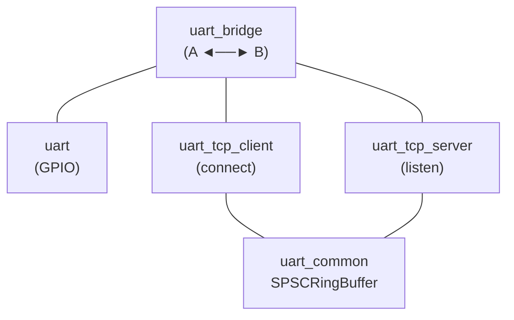
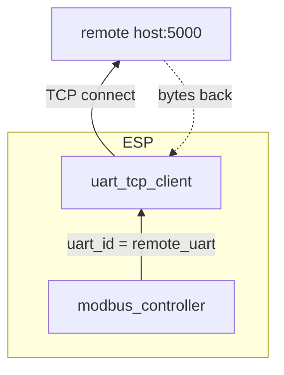
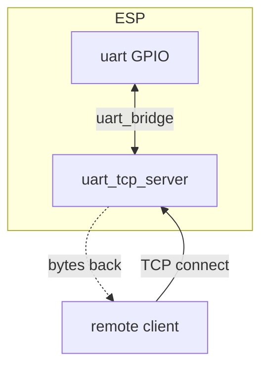
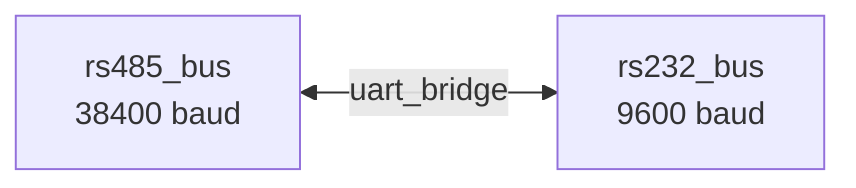
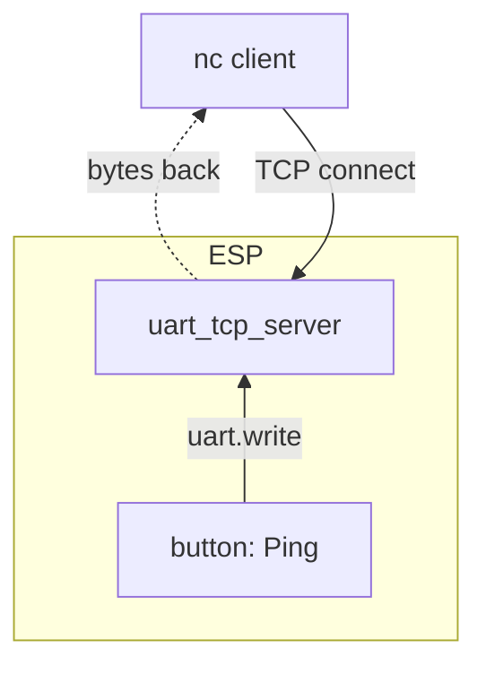
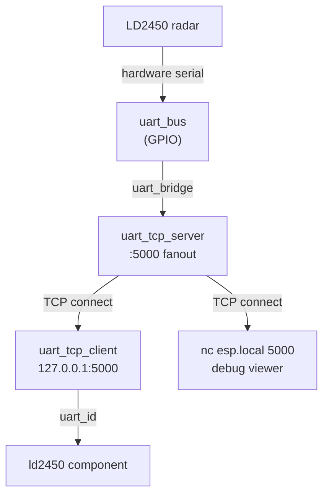

# esphome-uart-link

ESPHome external components for UART interconnection. Bridges hardware serial ports to TCP networks and each other. 
Transport-agnostic: any UART consumer sees the standard `available()` / `read_array()` / `write_array()` interface regardless of whether bytes come from GPIO pins, a TCP socket, or another UART.

## Components

| Component | Purpose |
|---|---|
| **uart_tcp_client** | Outbound TCP client which *is* a `UARTComponent`<br>use as a drop-in `uart_id` for any UART consumer. |
| **uart_tcp_server** | TCP server which *is* a `UARTComponent`<br>connected clients' data is available through the standard UART interface. |
| **uart_bridge** | Bidirectional byte forwarder between any two `UARTComponents`. |
| **uart_common** | Internal SPSC ring buffer (no user-facing config). |

All three configurable components support multiple instances using standard ESPHome list syntax (`-` prefix with unique `id`s).



## Installation

Add to your ESPHome YAML:

```yaml
external_components:
  - source:
      type: git
      url: https://github.com/nebulous/esphome-uart-link
```

## Component Reference

### `uart_tcp_client`

Connects to a remote TCP server and **is** a `UARTComponent`, not a wrapper around one. Any UART consumer can use it as a drop-in `uart_id`; reads and writes go over the TCP connection.

```yaml
uart_tcp_client:
  id: remote_serial
  host: 192.168.1.100
  port: 5000
  rx_buffer_size: 4096       # ring buffer size (default 4096)
  reconnect_interval: 5s     # auto-reconnect on disconnect (default 5s)
```

Includes stall detection: if no bytes arrive for 15 seconds, it forces a reconnect.

### `uart_tcp_server`

Listens on a TCP port and **is** a `UARTComponent`. It doesn't wrap a hardware UART; it *is* the UART, backed by TCP sockets. From the ESPHome side, anything reading from it sees bytes written by TCP clients; anything written to it gets sent to connected clients. Each client gets its own ring buffer; bytes from all clients are merged into a single read stream.

```yaml
uart_tcp_server:
  id: tcp_serial
  port: 5000
  max_clients: 2             # simultaneous connections (default 2, max 16)
  rx_buffer_size: 4096       # per-client ring buffer (default 4096)
  client_mode: fanout        # fanout (default) or exclusive
  idle_timeout: 0ms          # kick idle clients (0 = disabled)
```

**Client modes:**
- `fanout`: all connected clients see the same TX stream. Good for multi-monitor/tap scenarios.
- `exclusive`: only one client at a time. New connections disconnect the previous client. Better for command-response protocols.

### `uart_bridge`

Bidirectional byte forwarder between two UART references. Works with any combination of hardware UART, TCP client, TCP server, USB CDC ACM.

```yaml
uart:
  - id: rs485_bus
    tx_pin: GPIO17
    rx_pin: GPIO18
    baud_rate: 38400

uart_tcp_server:
  id: tcp_bus
  port: 5000

uart_bridge:
  uart_a: rs485_bus
  uart_b: tcp_bus
  buffer_size: 512           # internal copy buffer (default 512)
  direction: bidirectional    # bidirectional | a_to_b | b_to_a
```

**Supported topologies:**

| A | B | Use Case |
|---|---|---|
| hardware UART | hardware UART | RS485 ↔ RS232 protocol converter |
| hardware UART | tcp_server | Serial-to-network bridge (raw bytes, fixed baud rate) |
| tcp_client | hardware UART | Remote serial port consumer |
| tcp_client | tcp_server | Network serial proxy/repeater |
| tcp_server | tcp_server | Multi-party bus tap |

## Quick Examples

### Connect a UART component to a remote host, such as an ethernet serial bridge over TCP



`uart_tcp_client` acts as a `UARTComponent`. Point any UART consumer at it:

```yaml
uart_tcp_client:
  id: remote_uart
  host: 192.168.1.100
  port: 5000

modbus_controller:
  uart_id: remote_uart
```

### Expose a hardware serial port over the network



`uart_tcp_server` is a UARTComponent backed by TCP. Use `uart_bridge` to connect it to a hardware UART:

```yaml
uart:
  id: serial_port
  tx_pin: GPIO4
  rx_pin: GPIO5
  baud_rate: 9600

uart_tcp_server:
  id: network_port
  port: 5000
  client_mode: exclusive

uart_bridge:
  uart_a: serial_port
  uart_b: network_port
```

Then from any machine on the network: `nc esp-device.local 5000`

### Bridge two hardware UARTs



Protocol conversion between two serial buses running at different speeds:

```yaml
uart:
  - id: rs485_bus
    tx_pin: GPIO17
    rx_pin: GPIO18
    baud_rate: 38400
  - id: rs232_bus
    tx_pin: GPIO4
    rx_pin: GPIO5
    baud_rate: 9600

uart_bridge:
  uart_a: rs485_bus
  uart_b: rs232_bus
```

### Use a TCP server as a virtual UART (no hardware serial, no bridge)



`uart_tcp_server` can be used directly as a `uart_id` — no hardware UART or `uart_bridge` needed.
The TCP clients *are* the serial device.
Any automation that writes to a UART can write to it.
If no clients are connected, writes are silently dropped.

```yaml
uart_tcp_server:
  id: log_uart
  port: 2323
  max_clients: 4
  client_mode: fanout

button:
  - platform: template
    name: "Ping"
    on_press:
      - uart.write:
          id: log_uart
          data: "Hello from ESP!\r\n"
```

Then from any machine on the network: `nc my-esp.local 2323`
Press the button and the text appears in your nc session.

This pattern scales to any UART consumer component that accepts a `uart_id`.
See [InfinitESP](https://github.com/nebulous/infinitesp) for a production example:
a custom `sam_ascii` component uses `uart_tcp_server` directly as its UART to expose an HVAC CLI over the network.

## Design Notes

### Thread safety

`uart_tcp_client` and `uart_tcp_server` receive data in TCP callbacks that fire from
a TCP thread (ESP32) or the main loop (ESP8266).
The SPSC ring buffer in `uart_common` handles the producer/consumer split:
TCP callback writes, main loop reads. No mutex needed.

### Backpressure

`uart_bridge` has no flow control.
If a destination can't keep up, bytes buffer in its transport layer
(DMA/FIFO for hardware UART, AsyncClient send buffer for TCP).
The bridge assumes both sides can keep up.
For very high baud rates, increase `buffer_size`.

### Raw byte stream — no flow control or RFC 2217

The TCP transport carries raw bytes only.
It does not implement RFC 2217 (telnet COM port control),
hardware flow control signals (RTS/CTS, DTR/DSR),
or baud rate negotiation over the network.
The hardware UART baud rate is set once in YAML and stays fixed.

This means:
- **Works well:**
  protocols that use a fixed baud rate and don't depend on modem control signals
  (Modbus RTU, most smart meters, HVAC serial, BMS, RS485 buses, raw data streaming).
- **Doesn't work:**
  scenarios that require changing baud rates mid-session
  (e.g., the 1200-baud reset trick some bootloaders use)
  or toggling DTR/RTS from the remote end
  (e.g., `esphome upload` for some platforms).
  For those, use a USB connection or a full RFC 2217 bridge like ser2net.

### Poll-based limitation

ESPHome's UART API is purely poll-based (`available()` / `read_array()`).
There are no RX callbacks.
The bridge must live in `loop()`, which fires every few ms.
At 115200 baud (~11.5 bytes/ms) and below, loop timing shouldn't be the bottleneck
on ESP32 or ESP8266. The UART FIFO and driver-level buffering handle it comfortably.
At higher rates (460800+), the gap between `loop()` invocations can exceed
the hardware FIFO depth, and you may need to shrink the loop interval or increase `buffer_size`.

## Multi-Tap / Weird Topologies / Bad Ideas

Because `uart_tcp_client` and `uart_tcp_server` are both full `UARTComponent` instances,
they can be composed in ways that go beyond simple point-to-point bridging.
Some of these are genuinely useful. Some are just interesting.

### Loopback multi-tap (SPMC via self-connection)

ESPHome's UART is poll-based. Once bytes are read, they're gone.
You can't have two components reading from the same hardware UART.
But you *can* bridge the hardware UART to a `uart_tcp_server` in fanout mode,
then have a `uart_tcp_client` on the same ESP connect back to that server.
The tcp_server fans bytes out to all clients, one of which is the local tcp_client.
The actual UART consumer reads from the tcp_client.

This gives you a live read-only tap alongside a working UART consumer,
useful for debugging serial protocols in real time without disrupting the component
that's parsing them.



```yaml
external_components:
  - source:
      type: git
      url: https://github.com/nebulous/esphome-uart-link

uart:
  id: uart_bus
  tx_pin: GPIO5
  rx_pin: GPIO4
  baud_rate: 256000

uart_tcp_server:
  id: radar_tap
  port: 5000
  client_mode: fanout
  max_clients: 4

uart_tcp_client:
  id: radar_consumer
  host: 127.0.0.1
  port: 5000
  reconnect_interval: 2s

uart_bridge:
  uart_a: uart_bus
  uart_b: radar_tap

ld2450:
  id: ld2450_radar
  uart_id: radar_consumer   # reads via the loopback TCP client
  throttle: 100ms
```

Then `nc esp.local 5000` gives you a live raw byte stream
while the ld2450 component works normally.

**Why this works:**
`uart_tcp_server` in fanout mode is inherently SPMC (single producer, multiple consumers).
The hardware UART produces once, the server fans out to N consumers.
One consumer happens to be a local `uart_tcp_client`.

**Caveats:**

- The `uart_tcp_client` stall detector will force a reconnect after 15 seconds of silence.
  If the serial device goes quiet for extended periods, you'll get reconnect storms.
  Extend or disable the stall timeout for this use case.

- Every byte travels through the bridge, into the TCP server, across lwIP loopback,
  into the TCP client, through its ring buffer, and finally to the component.
  There's a latency and memory cost. Fine for 256000 baud and below,
  probably not what you want for high-throughput or latency-sensitive protocols.

- No flow control. If the consumer is slow, its ring buffer fills and bytes are lost.
  Same as any UART overflow, but now there are two ring buffers in the path.

### Other questionable ideas

- **uart_bridge between two tcp_servers:**
  Multi-party bus tap with no hardware UART at all.
  Two different ESPs each run a tcp_server, one runs a bridge,
  and external clients connect to both.
  Useful if you want to snoop on a conversation between two TCP serial devices.

- **Chained bridges:**
  Bridge hardware UART → tcp_client → (network) → tcp_server → bridge → hardware UART.
  Serial over two network hops. It works, but adds latency at each hop
  and you should probably just run a longer cable.

- **tcp_server as a UART interconnect between two ESPs:**
  ESP A runs tcp_server, ESP B runs tcp_client pointed at A and bridges it to a hardware UART.
  Both sides read/write through their respective UARTs.
  It's a wireless serial cable, with all the reliability of WiFi.

## License

MIT
